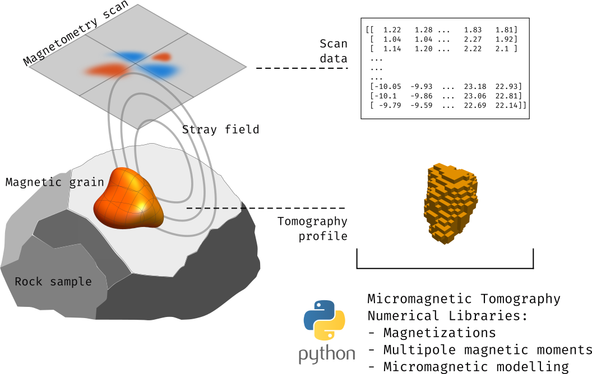

# Micromagnetic Tomography: Numerical Libraries

This repository contains the scripts and code snippets for reproducing the
results of the publication *Micromagnetic Tomography: Numerical Libraries* by
D. Cortés-Ortuño, F. Out, M. Kosters, K. Fabian and L. V. de Groot.

# Notebooks

The directory [notebooks](notebooks/) contains Jupyter notebooks with the codes
to reproduce the data discussed in the publication. Each notebook has
associated a Python script with the same name, which reproduces the data and
plots if it is executed directly. These are
 scripts that can be transformed
into the notebooks files.

- Two uniformly magnetized cuboids, one above the other, with varying separation. This is a test problem for the homogeneously magnetized particle (HMP) model: [two_dipoles_sep.ipynb](notebooks/two_dipoles_sep.ipynb)
- A perfect quadrupole to test multipole expansion model (MPE) inversions: [quadrupole.ipynb](notebooks/quadrupole.ipynb)
- Benchmark problem to compare the HMP and MPE models using the data from a synthetic sample with few magnetic inclusions. The data is from de Groot et al. (2018)† publication and the notebook focus on Area 1: [synthetic_sample_Area1.ipynb](notebooks/synthetic_sample_Area1.ipynb)
- Benchmark problem using Area 2: [synthetic_sample_Area2.ipynb](notebooks/synthetic_sample_Area2.ipynb)
- Benchmark problem using Area 3: [synthetic_sample_Area3.ipynb](notebooks/synthetic_sample_Area3.ipynb)
- Micromagnetic modelling of a natural magnetite grain from Nikolaisen et al. (2020)†† and modelled by Cortés-Ortuño et al. (2022)†††: [micro_demag_signature_Ngrains.ipynb](notebooks/micro_demag_signature_Ngrains.ipynb)

† de Groot et al. (2018) Determining Individual Particle Magnetizations in Assemblages of Micrograins. Geophysical Research Letters 45, 2995–3000.

†† Nikolaisen et al. (2020) Hysteresis of natural magnetite ensembles: Micromagnetics of silicate-hosted magnetite inclusions based on focused-ion-beam nanotomography. Geochemistry, Geophysics, Geosystems 21, e2020GC00938.

††† Cortés-Ortuño, D., Fabian, K., de Groot, L.V., 2022. Mapping magnetic signals of individual magnetite grains to their internal mag-459 netic configurations using micromagnetic models. Journal of Geophysical Research: Solid Earth 127, e2022JB024234.

# Citation
